# Audit Pipeline Specification

> Status: living — kept in sync with the audit code. Last reviewed 2026-09.

Scope: the end-to-end path that records every policy decision a Hexgate-wrapped
agent makes, from the SDK enforcement point to durable storage in ClickHouse and
the dashboard read view. LLM-usage and ban-enforcement events ride the same
pipeline (same sender, same collector, same enricher, their own tables) and are
called out where they differ.

This document is descriptive of the current implementation: the SDK's OTel
span emitter (#146), the Go collector (#128/#130/#131), the Redpanda topics
(#136), the span-enricher job (#133) and the deploy stack (#157). Where
behaviour is intentionally lossy or POC-grade, it says so explicitly.

---

## 1. Overview

Every time an agent proposes a tool call, the SDK's `PolicyEnforcer` produces a
`Decision` (allow / deny / needs_approval). The audit pipeline ships a copy of
that decision — **out of band, fire-and-forget** — to the platform, which
validates it, resolves server-owned identity fields, and appends one immutable
row to a ClickHouse table. Audit emission is a **side effect of enforcement**:
it never changes, blocks, or fails the decision the agent acts on.

```mermaid
flowchart LR
  classDef customerBox fill:#EAF7EC,stroke:#2E9E44,stroke-width:2px,color:#1B5E20
  classDef sdkBox fill:#EAF2FF,stroke:#2F6FED,stroke-width:2px,color:#153E90
  classDef hexBox fill:#F3EAFB,stroke:#8E3FC7,stroke-width:2px,color:#4A148C
  classDef redpandaBox fill:#FCE8EC,stroke:#D6336C,stroke-width:2px,color:#8A1538
  classDef pgBox fill:#FFF6E0,stroke:#E0A800,stroke-width:2px,color:#7A5900

  subgraph CUST["Customer application"]
    A["Agent code"]:::customerBox --> B["Hexgate SDK<br/>PolicyEnforcer → AuditSender → BatchSpanProcessor queue"]:::sdkBox
  end

  B -->|"OTLP/HTTP protobuf<br/>POST /v1/traces · Bearer api_key"| P["Reverse proxy<br/>app.hexgate.ai"]:::hexBox
  P -->|"path /v1/traces → HEXGATE_OTLP_PORT<br/>(host 7001/7201 → container :4318)"| C["Go Collector<br/>biscuit auth · batch 5s / 512 spans"]:::hexBox
  P -->|"all other paths"| F["FastAPI platform API"]:::hexBox
  C --> K["Redpanda topic<br/>hexgate.otlp.raw"]:::redpandaBox
  K --> E["span-enricher job<br/>decode semconv · redact · batch insert"]:::hexBox
  E --> CH[("ClickHouse")]:::hexBox
  E -->|"lookup agent_version_id"| PG[("Postgres")]:::pgBox
  C -->|"key lookup + revocation poll<br/>(devtoken table, every 20s)"| PG
  F <-->|"control-plane data:<br/>orgs, projects, agents, API keys"| PG
  D["React dashboard"]:::hexBox -->|"audit & usage queries"| F
  F -->|"reads audit/usage rows"| CH
```



The SDK side in more detail: `PolicyEnforcer.decide()` returns the `Decision`
to the agent synchronously and authoritatively, then hands a copy to
`AuditSender.emit()` as one OTel span, best-effort, through a bounded
`BatchSpanProcessor` queue that drops on saturation (§3). ClickHouse holds
`hexgate_audit.policy_decision`, `llm_invocation` and `ban_enforcement`
(§5); the dashboard reads them through the project-scoped aggregation
endpoints (§7).

### Design principles

1. **Enforcement is authoritative; audit is observational.** The `Decision`
   returned to the agent is the source of truth. Audit failures (network down,
   platform 503, saturation) degrade silently and never propagate to the caller.
   The same `Decision` is also surfaced locally by `hexgate chat`'s decision
   panel — same data, different sink, useful when iterating offline.
2. **The server owns identity.** `project_id`, `agent_version_id`, and
   `received_at` are resolved/stamped server-side and are **never trusted from
   the request body**, even though the SDK sends some of them as empty strings.
3. **One envelope, many event types.** The first eight columns/fields are a
   shared "envelope" intended to be reused by future event tables
   (`tool_invocation`, …). `policy_decision` is the first concrete event.
4. **Lossy under pressure, never blocking.** Both the SDK (drop on saturation)
   and the storage layer (byte caps, truncated `arguments`) prefer dropping or
   truncating data over slowing the agent.

---

## 2. The audit record

### 2.1 Stamped at the emission site

`hexgate/audit.py` — `AuditEvent` stamps the two audit identifiers at
construction. They live on the event, not on `Decision`: they exist only for
audit emission, and the no-audit path never constructs an event (so a
`decide()` call without a sender mints neither).

| Field | Type | Source |
|-------|------|--------|
| `event_id` | `UUID` | `uuid4()` per event — the idempotency key end-to-end |
| `occurred_at` | `datetime` (UTC) | `datetime.now(timezone.utc)` at construction |

The enforcer builds the `AuditEvent` immediately after the `Decision`, so
`occurred_at` is decision time for practical purposes. The decision fields
(`agent_name`, `tool_name`, `outcome`, `user_roles`, `deciding_role`, `reason`, `error_type`,
`violations`, `hint`, `arguments`) are populated by `Decision.from_verdict()`
from the policy engine's `Verdict` plus host context.

### 2.2 Outcome and error_type

```
DecisionOutcome   wire value        error_type (derived)
ALLOW             "allow"           "" (no error tag)
DENY              "deny"            "policy_denied"
NEEDS_APPROVAL    "needs_approval"  "approval_required"
```

### 2.3 Wire format — one OTel span per event, `AuditEvent.span_attributes()`

`hexgate/audit.py` — `AuditEvent` wraps a `Decision` plus the caller identity
read from the active `HexgateContext` scope (`user_id`, `session_id`). The
sender turns it into one OpenTelemetry span under instrumentation scope
**`hexgate.audit`**; `span_attributes()` produces the span's flat attribute
map. Every key is a constant in `hexgate/tracing/semconv.py` — the single
wire contract shared with the platform's span-enricher job, which decodes by
the same names:

```
scope: hexgate.audit                       (AuditEvent.SCOPE)
start_time == end_time = occurred_at       (point-in-time event; no attribute)

sec_ai.event_id       "0b9c…"              str(UUID) — the idempotency key
sec_ai.agent_name     "example_agent"
sec_ai.tool_name      "read_file"
sec_ai.outcome        "deny"
sec_ai.user_roles     ["analyst", "billing"]   native string array; [] when none
sec_ai.deciding_role  ""                   role that granted/gated it; "" on a deny
sec_ai.error_type     "policy_denied"      "" for allow
sec_ai.reason         "denied for path"
sec_ai.violations     ["v1", "v2"]         native string array, capped (§7)
sec_ai.hint           '{"glob": "/x/**"}'  JSON *string*; absent when unset
sec_ai.arguments      '{"path": "/etc/passwd"}'  JSON string; redacted + capped; absent when unset
sec_ai.attributes     '{"department": "finance"}' JSON string; caller ABAC bag; absent when empty
sec_ai.user_id        "alice"              "" when no request context
sec_ai.session_id     "sess_1"             "" when unset
```

Two shape rules worth knowing: the dict fields travel as **JSON strings**
(their platform byte caps are defined in serialized-JSON bytes, so the capped
quantity stays the measured one), and unset optional fields are **left out**
rather than sent as null (OTel attributes can't carry `None`; the enricher
defaults them). `occurred_at` is the span's `start_time_unix_nano`, not an
attribute. Server-resolved fields (`project_id`, `agent_version_id`,
`received_at`) are **deliberately absent**: `project_id` in particular is
derived from the bearer by the Collector's auth extension and travels as the
Kafka record key — a self-declared project on the span is never trusted.

---

## 3. SDK emission layer

### 3.1 Where emission happens

`PolicyEnforcer.decide()` (`hexgate/security/enforcer.py`):

1. Resolve the caller's role *set* from the active `HexgateContext` contextvar
   (deduped, capped at 32; `[None]` when unroled).
2. Evaluate each role and fold the verdicts permissively (`ALLOW` >
   `NEEDS_APPROVAL` > `DENY`), short-circuiting on the first allow; lift the
   winner into a `Decision` carrying `user_roles` + `deciding_role`.
3. If an `AuditSender` was injected into this enforcer, `emit()` an `AuditEvent`.
4. Return the `Decision` to the adapter (synchronous, unaffected by step 3).

The sender is **injected per enforcer**, not looked up globally — see §3.4.

### 3.2 `AuditSender` — one OTel span per event

`hexgate/tracing/_senders.py` — shared by `hexgate.audit` (policy decisions),
`hexgate.tracing.usage` (LLM token usage) and `hexgate.security.bans` (ban
enforcements); none of those modules owns it. One sender per `api_key` holds
one `TracerProvider` → `BatchSpanProcessor` → `OTLPSpanExporter` chain and
three tracers, one per instrumentation scope (`hexgate.audit` /
`hexgate.usage` / `hexgate.bans`) — the scope name is how the platform tells
the event types apart. `emit(event)` starts a span on the event's tracer with
`start_time = occurred_at`, sets `event.span_attributes()`, and ends it at the
same instant. Key behaviours:

- **Never blocks, never raises for transport.** `emit()` only enqueues the
  finished span onto the processor's in-memory queue; a worker thread batches
  and POSTs on a timer (5s) or size trigger (512). Export failures surface as
  the exporter's own log lines, never to the agent.
- **Drop on saturation.** The queue is bounded (2048 spans); when full, each
  new span silently evicts the oldest queued one (a bounded deque — OTel
  gives no signal), so `emit()` detects the eviction itself and logs a
  rate-limited warning (first drop, then every 10th). The warning stays on
  the stdlib logger, never OTLP: it must reach stderr precisely when the
  OTLP pipeline is the thing that's failing.
- **Thread-agnostic.** There is no event-loop affinity: `emit()` behaves the
  same on an asyncio loop thread, in a `run_in_executor` worker, and in a
  purely synchronous caller with no loop anywhere (pydantic_ai's `run_sync()`).
  The old asyncio-task / sync-thread fallback machinery, and the adapters'
  per-call `drain_pending_tasks()` hooks, are gone with it.
- **Always sampled, always a root span.** The provider uses `ALWAYS_ON` and
  each span starts from an empty `Context`, so a customer's own OTel tracing
  can neither parent our spans nor apply its sampling rate to them.
- **Retries** are the OTLP exporter's built-in backoff on 429/5xx, bounded by
  a 5s export timeout (`DEFAULT_EXPORT_TIMEOUT`, replacing OTel's 30s default
  so a slow platform can't hold process exit).
- **Auth:** `Authorization: Bearer <api_key>` header on every export.

### 3.3 Endpoint resolution

The exporter targets `HEXGATE_OTLP_ENDPOINT` when set, else
`<HEXGATE_API_URL>/v1/traces` (`hexgate.config.env.resolve_otlp_endpoint`).
The dedicated variable exists because the Collector's OTLP receiver can be
deployed on its own host/port (4318 by default) rather than behind the FastAPI
control plane; the fallback keeps the single-host case zero-config.

### 3.4 Configuration & lifecycle

`hexgate.audit.configure(api_key=None, base_url=None) -> AuditSender | None`
is a thin, decisions-specific wrapper around the shared
`hexgate.tracing._senders.get_or_create_sender()`:

- Resolves `api_key` from the argument or `HEXGATE_API_KEY`; returns `None` (audit
  inert) when no key is resolvable.
- Resolves `base_url` from the argument or `HEXGATE_API_URL`, defaulting to
  Hexgate Cloud (`https://app.hexgate.ai`); set `http://localhost:8000` when
  self-hosting. The export endpoint follows §3.3.
- **Keyed by `api_key`.** Senders live in a shared registry
  `dict[str, AuditSender]` in `hexgate/tracing/_senders.py`. One sender per
  key carries every event type — decisions, LLM usage and ban enforcements —
  since the span's instrumentation scope, not a separate endpoint, tells them
  apart. Calling `configure()` again with the **same** key returns the
  existing sender (idempotent); a **different** key gets its own sender with
  its own bearer token, which is what lets one process audit several
  tenants/keys.

Each adapter wrapper (`wrap_langchain_agent`, `wrap_openai_agent`,
`wrap_google_agent`, `wrap_pydantic_agent`) and `factory.enforce_policy` call
`configure()` with their resolved key and inject the returned sender into the
`PolicyEnforcer` they build. `bootstrap()` also calls `configure()` (env key) so
local runs work without an explicit key.

#### Local mode (`HEXGATE_LOCAL_MODE`)

The gate lives in `hexgate/tracing/_senders.py` and applies to every event
type sharing the registry, not just decisions. Setting `HEXGATE_LOCAL_MODE=1`
makes `configure()` (and `configure_usage_sender()`) return `None` even when
`HEXGATE_API_KEY` is present in env. `bootstrap(local_only=True)` sets the var
*before* the first `configure()` call, and `hexgate chat` passes
`local_only=True` — so the inner-loop REPL never posts audit events even if
a key has been lingering in `.env` from an earlier platform session.

The gate is re-checked on every `configure()` call (not cached), so an adapter
wrapper that re-`configure`s post-bootstrap still respects it. The truthy
value parser accepts `1` / `true` / `yes` / `on` (case-insensitive).

There are now two clean operating modes, not three:

| Mode | `HEXGATE_API_KEY` | `HEXGATE_LOCAL_MODE` | Policy from | Audit |
|------|---------------|----------------------|-------------|-------|
| **Local** | (irrelevant) | `1`, or unset with no key | YAML / disk / builtin | suppressed |
| **Platform-managed** | set | unset | platform fetch | emitted |

A single INFO line (`sender suppressed: HEXGATE_LOCAL_MODE=1 (...)`) is
logged the first time a sender is requested with both a key and local mode
active — exactly the case where the suppression would be surprising — and
once per process thereafter stays quiet. The "no key anywhere" case never
logs.

A separate WARNING fires from `bootstrap()` itself when both `HEXGATE_API_KEY`
and `HEXGATE_LOCAL_POLICY` are set — that combination is almost always a
forgotten env entry from an earlier session, and surfacing it at startup
saves a later debugging detour.

> For the user-facing description of when each mode applies in practice
> — chat vs. serve, inner loop vs. team loop — see the
> ["Which path do I pick?"](/two-paths) page.

#### Shutdown contract — host applications must flush

`async shutdown()` flushes every sender's queued spans and stops its worker
**across the whole shared registry** — decisions, LLM usage and ban
enforcements alike. It is safe to call multiple times and is the required
teardown hook: **the host application calls `await hexgate.audit.shutdown()`
before exit.** Either `hexgate.audit.shutdown()` or
`hexgate.tracing.usage.shutdown()` does it, since both delegate to
`hexgate.tracing._senders.shutdown()`.

Why it's required: normal traffic flushes itself on the processor's 5s timer,
but the final in-flight batch only leaves the process on an explicit flush.
The processor's worker is a **daemon thread** — it does not keep the
interpreter alive to finish a pending export the way the old non-daemon
fallback threads did. There is one safety net: `TracerProvider` registers an
`atexit` hook (`shutdown_on_exit=True`) that performs the same flush, bounded
by the export timeout, so a script that forgets still usually gets its tail
out — but an interpreter that exits via `os._exit`, a killed worker, or a
flush that outlives the timeout loses whatever was queued. Call `shutdown()`.

| Function | Purpose |
|----------|---------|
| `hexgate.tracing._senders.get_or_create_sender(key, url)` | Get-or-create the sender for `key`. Idempotent per key. |
| `hexgate.tracing._senders.get_sender(key)` | Registry lookup by `key` (diagnostics). Prefer the injected sender. |
| `hexgate.tracing._senders.shutdown()` | Flush + stop every sender. |
| `hexgate.audit.configure(key, url)` / `hexgate.tracing.usage.configure_usage_sender(key, url)` / `hexgate.security.bans.configure_ban_sink(key, url)` | Per-module wrappers over `get_or_create_sender(key, url)`; all three return the same sender for the same key. |
| `hexgate.audit.get_sender(key)` / `hexgate.tracing.usage.get_usage_sender(key)` | Wrappers over `get_sender(key)`. |
| `hexgate.audit.shutdown()` / `hexgate.tracing.usage.shutdown()` | Both call the shared `shutdown()`; either flushes all event types. |

---

## 4. Platform ingest — Collector → Redpanda → span-enricher

The API does not ingest spans. Ingest is three services; the API only reads.

### 4.1 Collector (`platform/collector/`)

A custom OpenTelemetry Collector build (`builder-config.yaml`) with one
Hexgate-specific extension, `hexgatebiscuitauth`, attached to the OTLP
receiver. Deployed it listens on `:4318` (HTTP) behind the reverse proxy's
`/v1/traces` rule; the gRPC receiver on `:4317` is enabled but not published.

Per request, the extension:

1. **Parses the bearer envelope** `fty_<env>_<project>_<biscuit>` and verifies
   the Biscuit's signature against the platform's root Ed25519 public key
   (`hexgate.pub`, written by the API's keystore, mounted read-only). TTL
   caveats are checked against the current time. Any failure → **401**
   `invalid Hexgate API key`; the reason is logged at debug level only, to
   keep a stolen key from probing.
2. **Reads the `token_id` fact** from the authority block (the API key row's
   own id, platform-api #126) and looks it up in a **revocation snapshot** of
   the key table, polled from Postgres every 20 s. Revoking a key deletes its
   row, so absence = revoked → **401**. A snapshot older than `max_staleness`
   (2 min, i.e. Postgres unreachable) makes the extension reject *everything*
   rather than let revoked keys keep working.
3. **Resolves `project_id` from the key's row**, not from the token's own
   `project` fact (a mint-time snapshot) and never from a span attribute, and
   attaches it as client metadata. `include_metadata` on the receiver and
   `metadata_keys: [project_id]` on the batch processor carry it through to
   the exporter, where `message_key_from_metadata_key` makes it the **Kafka
   record key**. The record key is the only project attribution downstream.

Processors: `memory_limiter`, a `resource` tag (`collector.name`), a
placeholder `attributes` tag, and `batch` (5 s / 512 spans, one batcher per
project; `metadata_cardinality_limit: 10000` is a hard ceiling on distinct
projects per process lifetime). Exporter: `kafka`, `otlp_proto` encoding,
`murmur2` sticky-key partitioning so one project always lands on one
partition.

The Collector **acks the HTTP request before the Kafka publish**. A Redpanda
outage therefore looks like success to the SDK; the exporter retries and then
drops. The healthcheck does not surface this yet (see §9).

### 4.2 Redpanda (`platform/redpanda/`)

Two topics, created by `create-topics.sh` (`make redpanda-topics` locally, the
`redpanda-init` one-shot in the deploy stack). `auto_create_topics_enabled` is
switched off so a wrong topic name fails loudly instead of fabricating a
1-partition topic.

| Topic | Purpose | Partitions | Retention |
|---|---|---|---|
| `hexgate.otlp.raw` | span buffer between collector and enricher | 3 | 3 days |
| `hexgate.otlp.dlq` | permanently rejected records/spans (JSON envelopes) | 3 | 30 days |

Redpanda is a buffer, not a store: ClickHouse is the system of record, and the
raw topic only needs to outlive an enricher restart or redeploy. It is
PLAINTEXT with no auth and must never be exposed outside the Compose network.

### 4.3 span-enricher (`hexgate_api.jobs.enricher`)

One consumer-group member (`hexgate-enricher`), run from the API image with
`python -m hexgate_api.jobs.enricher`. On startup it verifies the three
ClickHouse tables against the expected schema and that both topics exist
(`TopicsMissing` otherwise). Per poll (`max_poll_records` 500, 1 s timeout),
in order:

1. **Decode** each record's bytes as `ExportTraceServiceRequest`. Undecodable
   bytes → one DLQ envelope for the whole record.
2. **Attribute the project** from the record key. A missing or non-UTF-8 key
   can only come from a foreign producer; every span in such a record goes to
   the DLQ (`missing_key`).
3. **Map and validate** each span by instrumentation scope — `hexgate.audit`
   → `DecisionEvent`, `hexgate.usage` → `LlmInvocationEvent`, `hexgate.bans` →
   `BanEnforcementEvent` (the platform pydantic schemas, so the same max
   lengths and enum checks apply everywhere). `occurred_at` is the span's
   `start_time_unix_nano` (zero → rejected). A rejected span becomes a DLQ
   envelope; its siblings in the same record are unaffected.
4. **Resolve `agent_version_id`** for every distinct `(project_id, agent_name)`
   in the batch — two Postgres queries regardless of batch size. Unregistered
   agents resolve to `""` and are inserted anyway.
5. **Insert**, three batch inserts (one per table), retried as a whole with
   exponential backoff (cap 30 s) until ClickHouse acks. The consumer's
   `max_poll_interval` is raised to 30 min so a ClickHouse outage does not get
   the partition reassigned to a replica that would hit the same outage.
6. **Send DLQ envelopes**, then **commit offsets**.

Committing only after the ack means a crash anywhere in the cycle replays the
poll. That is safe for the tables — `event_id` is the idempotency key and the
tables are `ReplacingMergeTree` — and merely duplicates DLQ envelopes, which
carry no dedup key (consumers of the DLQ must tolerate that).

DLQ envelopes are JSON, keyed by project like the source record, and carry the
decoded attributes with the dict-typed fields redacted (same sensitive-key
regex as the SDK) and capped, plus a `_source` pointer (topic/partition/offset)
back to the raw bytes for as long as the raw topic's retention lasts.

### 4.4 Trust boundary

The span body carries only the envelope fields (`event_id`, `occurred_at` as
span start, `agent_name`, `session_id`, `user_id`) plus the event fields.
`project_id` is derived by the Collector from the key's database row and
travels as the record key; `agent_version_id` is a platform lookup;
`received_at` is stamped by ClickHouse. None of the three can be set by an SDK.

### 4.5 Legacy HTTP ingest

`POST /v1/audit/decisions`, `POST /v1/audit/ban-enforcements` and
`POST /v1/audit/llm-invocations` (`features/audit/router.py`,
`features/llm_invocations/router.py`) still exist: one event per request,
same bearer via `require_project`, same pydantic validation, synchronous
single-row insert, `202 {"event_id"}` on success. They predate the OTLP
pipeline, the SDK no longer calls them, and they are slated for removal.
Nothing new should target them.

---

## 5. Storage — ClickHouse

`platform/clickhouse/init/schema.sql`. Database `hexgate_audit`, table
`policy_decision`.

> ⚠️ The `init/` directory runs **once on an empty volume**. Editing the schema
> after first boot is ignored — use a real migration runner for changes.

### 5.1 Schema

```sql
CREATE TABLE hexgate_audit.policy_decision
(
  -- Envelope (shared with future event tables)
  event_id            UUID,
  occurred_at         DateTime64(3, 'UTC'),
  received_at         DateTime64(3, 'UTC') DEFAULT now64(3),   -- server-stamped
  project_id          LowCardinality(String),
  agent_name          LowCardinality(String),
  agent_version_id    LowCardinality(String) DEFAULT '',
  session_id          String                 DEFAULT '',
  user_id             LowCardinality(String) DEFAULT '',

  -- Decision-specific
  tool_name           LowCardinality(String),
  outcome             Enum8('allow'=1, 'deny'=2, 'needs_approval'=3),
  error_type          LowCardinality(String) DEFAULT '',
  reason              String,
  violations          Array(String),
  hint                String CODEC(ZSTD(3)),
  arguments           String CODEC(ZSTD(3)),  -- SDK-truncated JSON; may be lossy
  attributes          String CODEC(ZSTD(3)),  -- caller ABAC bag (ctx.*); redacted + truncated
  -- Roles are stored only as a set — there is no legacy scalar `role` column.
  -- An SDK predating multi-role sends one; the API folds it into user_roles
  -- at ingest, so every stored row is the same shape whatever wrote it.
  user_roles          Array(LowCardinality(String)),
  deciding_role       LowCardinality(String) DEFAULT ''       -- '' when every role denied
)
ENGINE = MergeTree
PARTITION BY toYYYYMM(occurred_at)
ORDER BY (project_id, agent_name, outcome, occurred_at)
TTL toDateTime(occurred_at) + INTERVAL 90 DAY
SETTINGS index_granularity = 8192;
```

- **`occurred_at`** is event time (SDK), **`received_at`** is ingest time
  (server default). Reads order by `received_at`; retention/partitioning key off
  `occurred_at`.
- **Sort key** `(project_id, agent_name, outcome, occurred_at)` optimizes the
  expected query shape: "decisions for a project/agent, filtered by outcome,
  newest within a window."
- **`hint` / `arguments`** are stored as ZSTD-compressed JSON strings, not native
  JSON, and are documented as potentially lossy (`arguments` is SDK-truncated;
  see §6).
- **TTL 90 days** — rows self-expire, consistent with the ingest retention guard.

### 5.2 Insert semantics

The enricher writes through `insert_decisions_batch` /
`insert_llm_invocations_batch` / `insert_ban_enforcements_batch`
(`features/audit/service.py`, `features/llm_invocations/service.py`): one
multi-row insert per table per poll, retried until acked (§4.3). The legacy
HTTP ingest uses the single-row `insert_decision`, whose settings are:

- **Byte caps before write:** `arguments` JSON ≤ 8 KiB, `hint` JSON ≤ 4 KiB,
  `attributes` JSON ≤ 4 KiB — each checked independently, else
  `AuditPayloadTooLarge` → 413. `None` serializes to `""`.
- **Insert settings:** `async_insert=1`, `wait_for_async_insert=1`,
  `async_insert_deduplicate=1`. Small inserts are batched server-side, but the
  call **blocks until the batch flushes**, so a write failure surfaces
  synchronously rather than being acked-then-dropped — an audit log must not
  silently lose acknowledged rows.
- **Dedup:** `async_insert_deduplicate` plus the unique `event_id` provides
  idempotency across SDK retries (the exporter's backoff retries, or any
  at-least-once delivery): re-sending the same `event_id` does not create a
  duplicate row.

---

## 6. Privacy & data-handling notes

- **`arguments` carries tool inputs** (paths, payloads, possibly PII). It is
  transmitted to the platform and stored (compressed) for up to 90 days. The
  default `base_url` is **plaintext `http://localhost:8000`**; production
  deployments must set `HEXGATE_API_URL` to a TLS endpoint.
- **Default key-name redaction, always on.** `AuditEvent.span_attributes()` replaces
  values whose key matches `password|passwd|secret|token|api[-_]?key|
  credential|authorization` (case-insensitive, recursive into nested
  dicts/lists) with `"[REDACTED]"` before transmission. **This is a seatbelt,
  not a guarantee**: values sensitive by *content* rather than key name — SQL
  strings, email bodies, free text — are captured verbatim. Operators whose
  tools carry such data need their own redaction before relying on this in
  production.
- **`attributes` redaction is anchored to the whole key**
  (`_SENSITIVE_ATTR_KEY_RE`), where `arguments` uses the substring rule above.
  The bag holds policy facts rather than caller payloads: blanking
  `authorization_tier` or `access_token_scope` would leave the `ctx.*`-driven
  deny they caused unexplainable, defeating the reason the bag is persisted at
  all. A key named exactly `token` still reads as a secret and is blanked.
- **SDK truncation at the platform cap.** `span_attributes()` measures `arguments`
  as the platform does (JSON, `default=str`); over 8 KiB it replaces the dict
  with `{"_truncated": true, "original_bytes": N, "preview": <JSON prefix>}`
  sized to fit the cap. Lossy, but the event is stored — the platform
  **rejects** (413) oversize payloads, so an untrimmed over-cap decision would
  not be stored at all. `attributes` (4 KiB) and `hint` (4 KiB) go through the
  same `_truncate_json(payload, cap=...)` helper. Only the audit copy is
  trimmed: the `Decision` the host holds — and `as_error_payload()`, which the
  model sees — keeps the full `hint`.
- **`attributes` carries the caller ABAC bag** (the `ctx.*` namespace the
  decision was evaluated against): stored for 90 days and rendered verbatim in
  the dashboard's audit detail drawer for anyone with project read access. It
  goes through the same key-name redactor as `arguments`, with the same
  seatbelt-not-a-guarantee caveat, so content-sensitive values (emails,
  customer identifiers) pass through. `docs/concepts/user-scope.mdx` warns
  callers to filter on the coarsest value the policy needs. Never rendered into
  `as_error_payload` — the model must not see it.

---

## 7. Read path — aggregation endpoints

The raw `GET /v1/audit/decisions?limit=N` debug dump has been **removed**.
Reads are now project-scoped aggregation endpoints that group server-side in
ClickHouse (query-time `GROUP BY`; no rollups/materialized views). The table's
sort key `(project_id, agent_name, outcome, occurred_at)` and `LowCardinality`
columns make these scans cheap. All time-axis logic keys off `occurred_at`
(event time), never `received_at`. See `platform/api/audit.py` (`summarize`,
`timeseries`, `list_decisions`).

| Endpoint | Returns |
|----------|---------|
| `GET /v1/projects/{id}/audit/summary?window=` | Totals + denial counts, plus breakdowns by agent / tool / user (one `GROUPING SETS` query) and by role (a second scan over the same `WHERE`). |
| `GET /v1/projects/{id}/audit/timeseries?window=` | Per-bucket outcome counts (`toStartOfInterval`); bucket size tracks the window. |
| `GET /v1/projects/{id}/audit/decisions?window=&agent=&role=&outcome=&limit=&offset=` | Filterable detail rows, newest first, with `total` for pagination; `hint`/`arguments` decoded back to objects. |

- **`window`** is `24h` / `7d` / `30d` / `90d`, validated by a `Literal` (bad
  value → 422) and bounded by the 90-day storage TTL. `role=` (empty value)
  selects the empty-role bucket; an absent `role` means "no filter". No
  sentinel string is reserved on the wire — the dashboard's "(none)" is a
  display label only.
- **`role` filters on membership** (`has(user_roles, …)`), so one call by
  `["billing","support"]` is returned under either name, subsuming the old
  `role = X` equality. `by_role` therefore counts *memberships* and
  `sum(by_role[*].all) >= totals.all` — hence its own scan, since an
  `arrayJoin` in the `GROUPING SETS` query would inflate every breakdown.
- **Concurrency.** A client firing several of these reads at once (e.g. a
  dashboard loading summary + timeseries + decisions together) would otherwise
  hit "concurrent queries within the same session". The shared, process-global
  ClickHouse client is created with `autogenerate_session_id=False`
  (`platform/api/clickhouse.py`) so the thread-safe HTTP pool serves concurrent
  queries in parallel; this also hardens the ingest path under load.

> Still POC-grade on **auth**: the endpoints are project-scoped (gap #1 partly
> closed) but not yet gated behind the `read_audit` scope — they carry a
> `TODO(auth)` marker, matching the unauth posture of the other dashboard reads
> (`/agents`, `/tokens`). Scope enforcement must land before exposure beyond
> local development.

---

## 8. Failure-mode summary

| Failure | SDK behaviour | Agent impact |
|---------|---------------|--------------|
| No api_key configured | `configure()` returns `None`; no sender injected | none (audit inert) |
| Sender saturated | oldest queued span evicted, rate-limited warning | none |
| Collector returns 429/5xx | exporter backoff-retries within the 5s export deadline, then drops the batch with a log | none |
| Collector returns other 4xx | export failure logged, batch dropped | none |
| Network unreachable | export failure logged after the 5s deadline, batch dropped | none |
| Process exits with spans queued | atexit hook flushes, bounded by the 5s shutdown timeout | exit delayed ≤ 5s |

| Failure | Platform behaviour |
|---------|--------------------|
| Bad/missing/revoked bearer | Collector 401; the SDK logs and drops the batch |
| Postgres unreachable > 2 min | Collector's revocation snapshot goes stale → **every** request 401s until Postgres is back (fail closed) |
| Redpanda unreachable | Collector has already acked 200; exporter retries then drops. Invisible to the SDK and to the current healthcheck (§9) |
| Enricher down / redeploying | Spans buffer in `hexgate.otlp.raw`; nothing lost within the 3-day retention; dashboard lags |
| ClickHouse unreachable | Enricher retries the batch with backoff (cap 30 s), commits nothing; consumer lag grows; `restart: unless-stopped` |
| Undecodable record / keyless record / span fails validation | DLQ envelope on `hexgate.otlp.dlq`; sibling spans still inserted |
| Unregistered agent_name | Inserted with `agent_version_id = ""` |
| Legacy HTTP ingest (§4.5): ClickHouse down / bad row / oversize / bad bearer / occurred_at out of window | 503 + `Retry-After` / 422 / 413 / 401 / 400 |

---

## 9. Open items / known gaps

1. **Pipeline health is not observable** — the Collector's healthcheck is a TCP
   probe on `:4318` that stays green in both real failure modes (revocation
   snapshot past `max_staleness` → every request 401s; Redpanda unreachable →
   acked spans dropped after retries). The enricher has no healthcheck at all
   and its insert retry is unbounded, so a wedged consumer stays "Up" while the
   raw topic's 3-day retention deletes what it never committed. Needs the
   `healthcheckv2` extension in the collector build with the auth extension
   reporting component status, and a heartbeat file plus a retry ceiling in the
   enricher. Until then `make platform-smoke` is the only end-to-end signal.
2. **`arguments`/`attributes` redaction is key-name-only** — the default
   redactor strips sensitive-keyed values, but content-sensitive values (SQL,
   email bodies, identifiers in the ABAC bag) pass through; no per-tool
   allow/deny lists, no `ctx.*` allowlist, no `redact` callable yet.
3. **Default transport is plaintext HTTP** — safe only for localhost; require
   TLS via `HEXGATE_API_URL` elsewhere.
4. **Schema evolution** — `init/schema.sql` runs once; there is no migration
   runner wired up yet. Interim convention: a DDL change also lands a
   hand-applied statement in `platform/clickhouse/migrations/`, run in filename
   order via `make clickhouse-cli` **before** deploying the API that references
   the new column. Exception: when no `ALTER` can restate pre-existing rows
   truthfully — the multi-role columns — no migration ships and the volume is
   recreated instead (`make clickhouse-reset`). A boot-time gap raises
   `SchemaOutOfDate`, which points the operator at both paths.
5. **At-least-once, not exactly-once end to end** — the SDK can drop on
   saturation/network failure (audit is best-effort); `event_id` dedup prevents
   duplicates but not gaps.
6. **Write path is unscoped within a project** — the Collector's auth extension
   (and the legacy `POST /v1/audit/*` via `require_project`) checks signature,
   revocation and project resolution only; any valid SDK bearer for the project
   can write audit, fetch policy, and register agents interchangeably. The biscuit attenuation primitive already exists
   (`platform/api/biscuits.py`); an `emit_audit` scope fact + endpoint check is
   the natural fix. Note existing minted tokens won't carry the fact — needs a
   deprecation window or re-mint.
7. **No rate limit or volume alerting on ingest** — an exfiltrated key can
   flood the log to bury real activity. Needs a per-project token bucket
   (`429 + Retry-After`; the SDK already logs-and-drops on ≥400) plus an
   ingest-volume-per-project alert.
