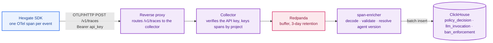

When you self-host, policy decisions are written to a ClickHouse instance backing
the audit dashboard. The commands below start a local one via Docker for dev and
self-hosting; in production, point the platform at your own ClickHouse cluster.
On [Hexgate Cloud](/platform/hosted) this is fully managed — nothing to run. For
the conceptual overview see [audit trail](/concepts/audit-trail); for the
engineering spec see [internals/audit-pipeline](/internals/audit-pipeline).

```bash
make clickhouse-up        # start the server (first run also creates the schema)
make clickhouse-cli       # interactive SQL shell
make clickhouse-down      # stop (keeps data)
make clickhouse-reset     # wipe and recreate (also re-applies the schema)
```

Schema lives in `platform/clickhouse/init/schema.sql`.

<Note>
**Schema init runs once.** The Docker image applies `init/schema.sql` exactly
once, on first container start with an empty data volume — editing the SQL
afterwards is ignored on existing environments. To apply a schema change, either
`make clickhouse-reset` (wipes data) or connect with `make clickhouse-cli` and run
the migration SQL by hand. In production, treat schema changes as a deliberate
maintenance step against your ClickHouse cluster.
</Note>

The service binds to **127.0.0.1 only, on host ports 8124 (HTTP) and 9001
(native)** rather than ClickHouse's default 8123/9000, so it coexists with any
other local ClickHouse instance (e.g. a Langfuse-bundled one).

## How events arrive

The SDK does not write to ClickHouse, and neither does the API. Events travel
as OpenTelemetry spans through three more services that a self-hosted stack
has to run alongside the API:



- **Collector** (`platform/collector/`, Go): the OTLP/HTTP receiver. Verifies
  the bearer API key's signature and revocation status, stamps the project id on
  every span as the Kafka record key, and publishes to Redpanda. A rejected key
  is a `401` back to the SDK; a self-declared project id in the span is never
  trusted.
- **Redpanda**: two topics, `hexgate.otlp.raw` (the buffer, 3-day retention)
  and `hexgate.otlp.dlq` (permanently rejected spans, 30 days). ClickHouse is
  the system of record; the raw topic only has to outlive an enricher restart.
- **span-enricher** (`hexgate_api.jobs.enricher`, same image as the API): a
  consumer that decodes each span by instrumentation scope into a decision,
  LLM-usage or ban-enforcement event, resolves `agent_version_id` from
  Postgres, and batch-inserts into the three tables. Offsets commit only after
  ClickHouse acknowledges, so a crash replays the batch; `event_id` plus
  `ReplacingMergeTree` collapses the duplicates.

Locally, `make collector-run` and `make enricher-run` start the two processes
against the dev Redpanda (`make redpanda-topics` creates the topics). The
reverse proxy in front of a deployed stack must route the path `/v1/traces` to
the collector rather than the API; the reference compose, ports and proxy rules
are in `platform/DEPLOY.md`, and `make platform-smoke STAGE=<stage>` sends one
of every event type through a live stage and checks each row arrived.

Integration tests (`pytest -m integration`) round-trip real spans through this
whole chain — opt-in so the default `make platform-api-test` stays
offline-friendly.

<Note>
**Legacy HTTP ingest.** The API still serves `POST /v1/audit/decisions`,
`POST /v1/audit/ban-enforcements` and `POST /v1/llm/invocations`, one event per
request with the same bearer. The SDK no longer calls them; they bypass the
collector and are slated for removal. Don't build on them.
</Note>

## Seed data

```bash
make seed-audit         # insert 820 rows of mock audit data
make seed-audit-clear   # delete seed rows
```

Inserts 800 normal rows spread over 30 days (Alice, Bob, Charlie across all
tools) plus 20 anomaly rows where Bob probes restricted tools
(`refund_customer`, `create_ticket`) with a default role in a 5-minute window 10
days ago.
